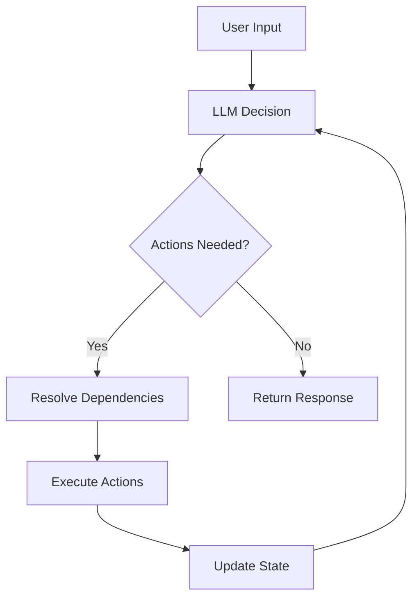

## What is the Task Loop?

The task loop is SpinAI's core decision-making process that:

- Analyzes user input
- Decides which actions to take
- Executes actions in order
- Determines when tasks are complete

## How it Works

1. **Decision Making**
   The LLM analyzes the input and available actions:

   ```typescript
   // LLM receives:
   - User's input
   - Available actions and their descriptions
   - Results from previous actions
   ```

2. **Action Selection**
   The LLM returns a decision:

   ```typescript
   interface LLMDecision {
     actions: string[]; // Actions to execute
     isDone: boolean; // Task completion status
     response: string; // Response to user
     reasoning?: string; // Optional explanation
     summary?: string; // Optional summary
   }
   ```

3. **Dependency Resolution**
   SpinAI orders the actions based on dependencies:

   ```typescript
   // Example dependency chain
   getCustomerInfo → validateSubscription → createTicket
   ```

4. **Action Execution**
   Actions run in order, sharing state through context:
   ```typescript
   // Each action:
   1. Receives the context
   2. Performs its task
   3. Updates the state
   4. Returns the modified context
   ```

## Decision Flow



## State Management

The task loop maintains state throughout the process:

```typescript
// Initial state
const context = {
  input: "user question",
  state: {},
};

// After actions run
const context = {
  input: "user question",
  state: {
    customerInfo: { ... },
    ticketId: "123",
    response: "I've created ticket #123",
  },
};
```

## Logging and Debugging

The task loop provides detailed logging:

```typescript
ℹ️ Processing request { input: "I need help" }
ℹ️ Planning next actions ["getCustomerInfo"]
ℹ️ Executing action: getCustomerInfo
ℹ️ Task complete { response: "I've found your info..." }
```

## Next Steps

<CardGroup>
  <Card title="Agents" icon="robot" href="/core-concepts/agents">
    Learn about agent configuration
  </Card>
</CardGroup>
