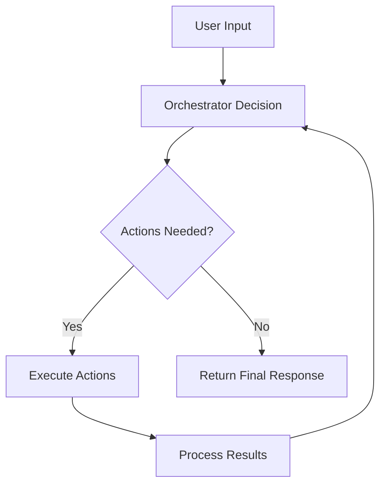

## The Task Loop

The task loop is the core mechanism that powers Spinai's orchestration system. It's a continuous cycle of:

1. Receiving user input
2. Consulting the orchestrator
3. Executing actions
4. Processing results



## How It Works

### 1. Input Processing

When a request comes in, Spinai:

- Receives the user's input
- Prepares the context for the orchestrator
- Includes any previous action results

### 2. Orchestrator Consultation

The orchestrator (typically GPT-4):

- Analyzes the user's request
- Reviews available actions
- Decides which actions to run
- Determines if the task is complete

```typescript
interface OrchestratorDecision {
  actions: string[]; // Actions to execute
  isDone: boolean; // Whether the task is complete
  summary?: string; // Optional explanation
  reasoning?: string; // Optional decision reasoning
}
```

### 3. Action Execution

For each selected action:

- Dependencies are resolved
- Actions are executed in order
- Results are stored
- Context is updated

### 4. Result Processing

After actions complete:

- Results are collected
- The orchestrator reviews results
- Decides on next steps or completion

## Example Flow

Here's a typical task loop in action:

```typescript
// 1. User sends request
const input = "Analyze this text and summarize it";

// 2. Orchestrator decides
const decision = await orchestrator.decide([{ role: "user", content: input }]);
// Decides to use: ["textAnalysis", "summarization"]

// 3. Execute actions in sequence
const results = {
  textAnalysis: await actions.textAnalysis.run(context),
  summarization: await actions.summarization.run({
    ...context,
    store: { analysis: results.textAnalysis },
  }),
};

// 4. Process and continue or complete
if (decision.isDone) {
  return { summary: decision.summary, results };
} else {
  // Continue the loop with new context
}
```

## Advanced Features

### State Management

- The task loop maintains state between iterations
- Previous results are available to subsequent actions
- Context is preserved throughout the workflow

### Error Handling

- Failed actions can be retried
- The orchestrator can adapt to failures
- Alternative action paths can be chosen

### Loop Control

- The loop continues until:
  - The orchestrator marks the task as complete
  - An error occurs
  - Maximum iterations are reached

## Best Practices

1. **Design Clear Actions**

   - Actions should have single responsibilities
   - Clear inputs and outputs
   - Well-defined error states

2. **Optimize Orchestrator Prompts**

   - Be specific about decision criteria
   - Include relevant context
   - Define clear completion conditions

3. **Handle State Carefully**

   - Use the store for sharing data
   - Clean up temporary state
   - Validate data between actions

4. **Monitor and Log**
   - Track loop iterations
   - Log decision reasoning
   - Monitor action performance
