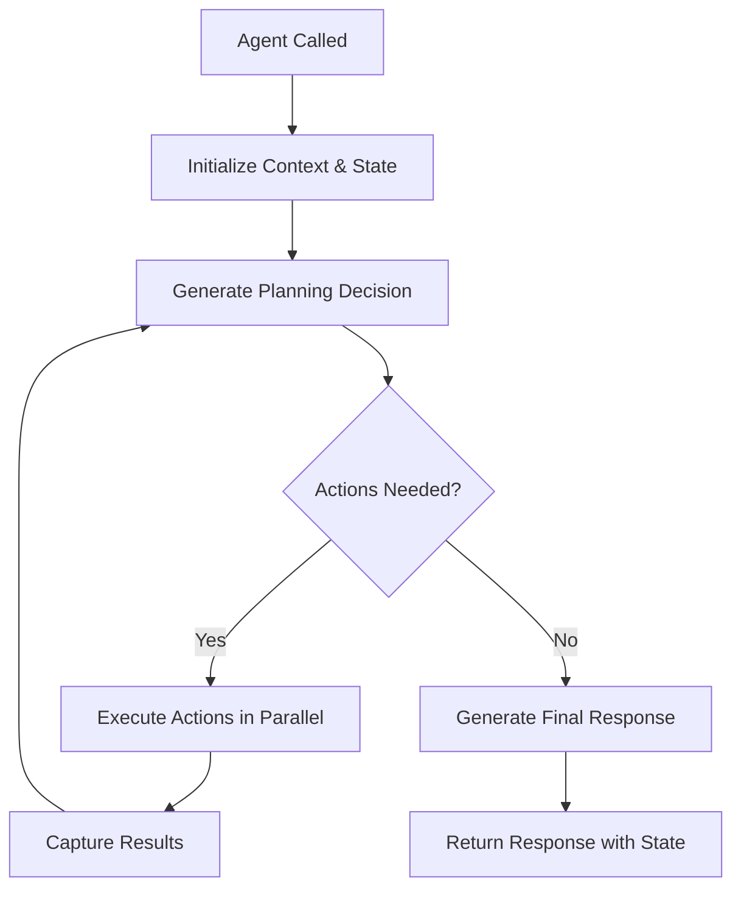

## What is the Task Loop?

The task loop is SpinAI's core decision-making process that orchestrates your AI agent's workflow. It handles:

- Planning which actions to run and when
- Determining parameters for each action
- Executing actions in parallel when possible
- Generating reasoning and final responses
- Maintaining state throughout the interaction
- Comprehensive logging and cost tracking

## How it Works

The task loop uses a sophisticated planning system that leverages your agent's LLM for key decisions:

1. **Planning and Reasoning**

   - Analyzes user input, current state, and previous action results
   - Provides explicit reasoning about what to do next
   - Decides which actions should run next (if any)
   - Returns a list of action IDs with their parameters

2. **Parallel Action Execution**

   - Executes multiple actions in parallel when possible
   - Each action receives the full context and specific parameters
   - Results from each action are captured and added to the conversation history
   - State is maintained and accessible across all actions

3. **Response Generation**

   - When no more actions are needed, generates a final response
   - Uses accumulated context, action results, and state
   - Can return plain text or structured data based on your responseFormat configuration
   - Provides detailed usage metrics (tokens, cost, duration)

## Flow Diagram

## Technical Implementation

The task loop is implemented with these key components:

1. **Message History Management**

   - Maintains a structured conversation history with system, user, assistant, and action result messages
   - Each message type has a specific purpose in the planning process

2. **Planning Schema**

   - Uses a structured JSON schema for planning decisions
   - Includes reasoning, next actions, and parameters for each action

3. **Error Handling**

   - Gracefully handles errors in action execution
   - Provides error information back to the agent for recovery

4. **Comprehensive Logging**
   - Tracks planning decisions, action executions, and final responses
   - Records performance metrics including token usage and costs

## Next Steps

<CardGroup>
  <Card title="Actions" icon="puzzle-piece" href="/core-concepts/actions">
    Learn how to use actions in agents
  </Card>
  <Card
    title="State & Parameters"
    icon="arrows-spin"
    href="/core-concepts/state-and-parameters"
  >
    Learn how state and parameters work
  </Card>
  <Card title="Observability" icon="eye" href="/core-concepts/observability">
    Learn how to make decisions observable
  </Card>
  <Card title="Agents" icon="robot" href="/core-concepts/agents">
    See how to use actions in agents
  </Card>
</CardGroup>
