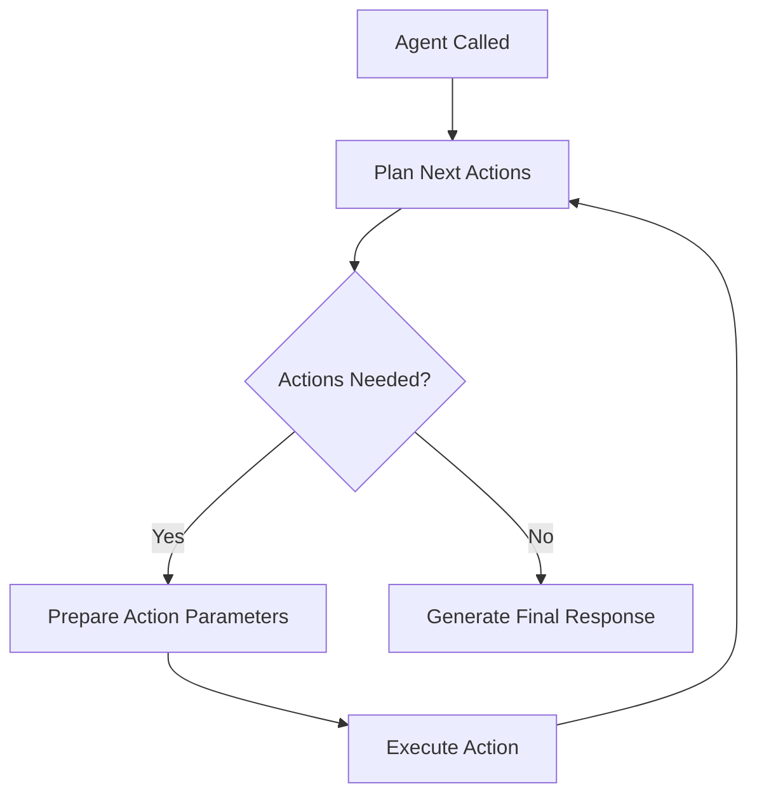

## What is the Task Loop?

The task loop is SpinAI's core decision-making process that uses a planner to:

- Determine which actions to run
- Prepare parameters for each action
- Execute actions in sequence
- Generate final responses

## How it Works

The task loop uses a planner that leverages your agent's LLM for three key decisions:

1. **Planning Next Actions**

   - Analyzes user input and current state, including already executed actions, and results
   - Decides which actions should run next
   - Returns a list of action IDs to execute

2. **Parameter Preparation**

   - Before each action runs
   - Determines exact parameters needed
   - Uses context from previous actions and state to pass in specific parameters into your action

3. **Response Generation**

   - When no more actions are needed
   - Creates final response to user
   - Uses accumulated context and state
   - Defaults to a string, but you can pass in a responseFormat to get structured JSON (see [Agents](/core-concepts/agents))

## Flow Diagram



## Example Flow

```typescript
// 1. Agent gets called
const result = await agent({
  input: "Add 5 and 3, then subtract 2",
  state: {},
});

// 2. Planner decides actions: ["sum", "minus"]

// 3. For first action (sum):
// - Prepare parameters: { a: 5, b: 3 }
// - Execute sum action
// - Result stored in state

// 4. For second action (minus):
// - Prepare parameters: { a: 8, b: 2 }
// - Execute minus action
// - Result stored in state

// 5. No more actions needed
// - Generate final response
// - Return result to user
```

## Next Steps

<CardGroup>
  <Card title="Agents" icon="robot" href="/core-concepts/agents">
    Learn about agent configuration
  </Card>
  <Card
    title="State & Parameters"
    icon="database"
    href="/core-concepts/state-and-parameters"
  >
    Understand state management
  </Card>
</CardGroup>
