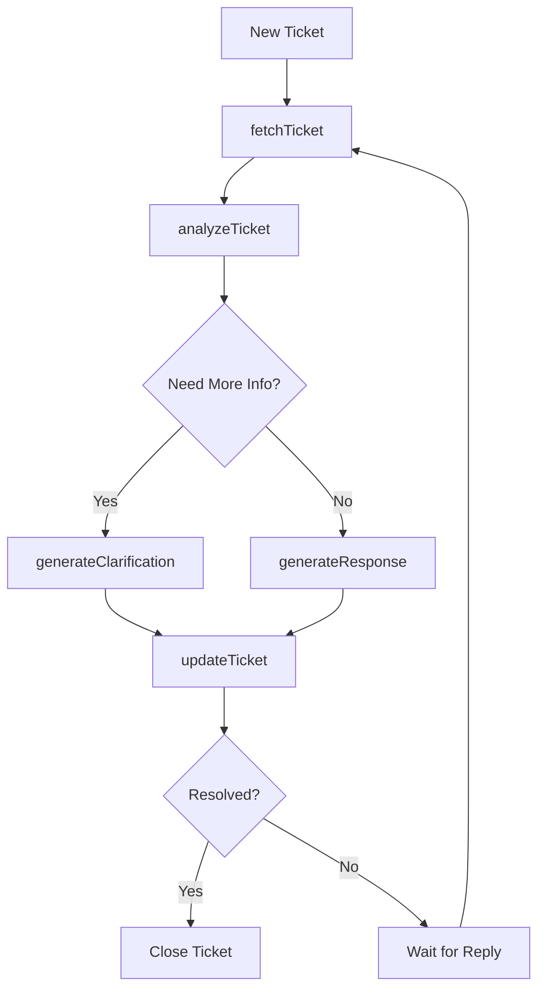

In this example, we'll demonstrate how to build an AI agent that helps customer support teams by integrating with Zendesk Support. The agent will be able to:

1. Retrieve ticket information from Zendesk
2. Analyze ticket content and customer history
3. Suggest appropriate responses
4. Update tickets with AI-generated responses

## Prerequisites

- A Zendesk Support account
- Zendesk API credentials (Admin token)
- Spinai installed in your project

## Workflow Overview

Here's how our AI agent will process support tickets:

## Benefits

1. **Automated Triage**: Automatically categorize and prioritize tickets
2. **Consistent Responses**: Generate standardized yet personalized responses
3. **Efficiency**: Reduce response time and agent workload
4. **Learning**: Improve responses over time through feedback
5. **Integration**: Seamless integration with existing Zendesk workflows
