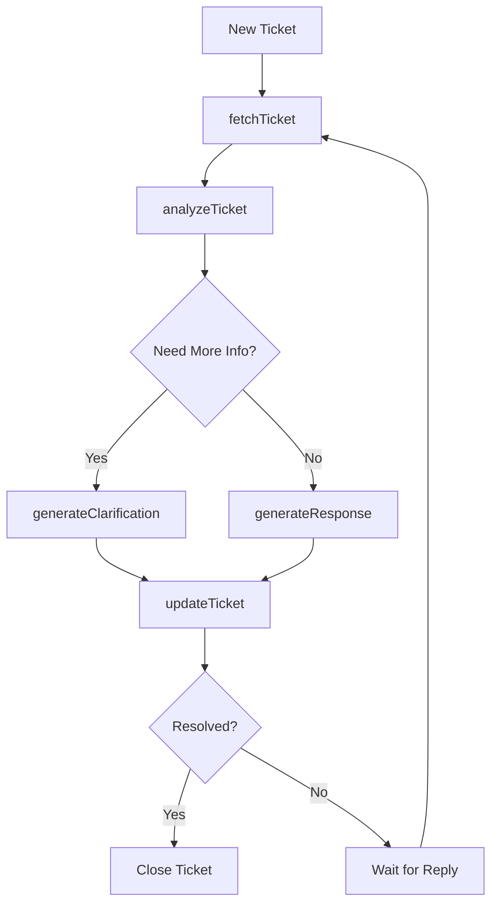

In this use case, we'll demonstrate how to build an AI agent that helps customer support teams by integrating with Zendesk Support. The agent will be able to:

1. Retrieve ticket information from Zendesk
2. Analyze ticket content and customer history
3. Suggest appropriate responses
4. Update tickets with AI-generated responses

## Prerequisites

- A Zendesk Support account
- Zendesk API credentials (Admin token)
- Spinai installed in your project

## Implementation Overview

We'll create several actions that work together:

1. `fetchTicket`: Retrieves ticket details from Zendesk
2. `analyzeTicket`: Analyzes the ticket content and history
3. `generateResponse`: Creates an appropriate response
4. `updateTicket`: Updates the ticket in Zendesk

Here's a diagram of the workflow:



## Action Implementation

### 1. Fetch Ticket Action

```typescript
export const config = {
  id: "fetchTicket",
  metadata: {
    description: "Retrieves ticket details from Zendesk",
  },
};

export async function run(context: ActionContext) {
  const { ticketId } = context.request.metadata;
  const { ZENDESK_TOKEN } = process.env;

  const response = await fetch(
    `https://your-domain.zendesk.com/api/v2/tickets/${ticketId}`,
    {
      headers: {
        Authorization: `Bearer ${ZENDESK_TOKEN}`,
      },
    }
  );

  return await response.json();
}
```

### 2. Analyze Ticket Action

```typescript
export const config = {
  id: "analyzeTicket",
  dependsOn: ["fetchTicket"],
  metadata: {
    description: "Analyzes ticket content and customer history",
  },
};

export async function run(context: ActionContext) {
  const ticket = context.store.fetchTicket;

  return {
    sentiment: analyzeSentiment(ticket.description),
    category: categorizeIssue(ticket.description),
    priority: determinePriority(ticket),
    needsMoreInfo: checkIfNeedsMoreInfo(ticket),
  };
}
```

### 3. Generate Response Action

```typescript
export const config = {
  id: "generateResponse",
  dependsOn: ["analyzeTicket"],
  metadata: {
    description: "Generates appropriate response based on analysis",
  },
};

export async function run(context: ActionContext) {
  const analysis = context.store.analyzeTicket;
  const ticket = context.store.fetchTicket;

  return {
    response: await generateAppropriateResponse(ticket, analysis),
    suggestedActions: getSuggestedActions(analysis),
  };
}
```

### 4. Update Ticket Action

```typescript
export const config = {
  id: "updateTicket",
  dependsOn: ["generateResponse"],
  metadata: {
    description: "Updates the Zendesk ticket with the generated response",
  },
};

export async function run(context: ActionContext) {
  const { ticketId } = context.request.metadata;
  const { response } = context.store.generateResponse;
  const { ZENDESK_TOKEN } = process.env;

  const updateResponse = await fetch(
    `https://your-domain.zendesk.com/api/v2/tickets/${ticketId}`,
    {
      method: "PUT",
      headers: {
        Authorization: `Bearer ${ZENDESK_TOKEN}`,
        "Content-Type": "application/json",
      },
      body: JSON.stringify({
        ticket: {
          comment: { body: response },
          status: "pending",
        },
      }),
    }
  );

  return await updateResponse.json();
}
```

## Usage

To use this agent, create a configuration file:

```typescript
import { createOpenAIOrchestrator } from "spinai";

export default createOpenAIOrchestrator({
  apiKey: process.env.OPENAI_API_KEY,
  systemPrompt: `You are a customer support assistant that:
    1. Analyzes support tickets
    2. Determines if more information is needed
    3. Generates helpful and empathetic responses
    4. Suggests appropriate actions`,
});
```

Then start the server:

```typescript
import { runAgentServer } from "spinai";

runAgentServer(3000);
```

Send requests to the agent:

```bash
curl -X POST http://localhost:3000/api/run \
  -H "Content-Type: application/json" \
  -d '{
    "input": "Handle this support ticket",
    "metadata": {
      "ticketId": "12345"
    }
  }'
```

## Benefits

1. **Automated Triage**: Automatically categorize and prioritize tickets
2. **Consistent Responses**: Generate standardized yet personalized responses
3. **Efficiency**: Reduce response time and agent workload
4. **Learning**: Improve responses over time through feedback
5. **Integration**: Seamless integration with existing Zendesk workflows
